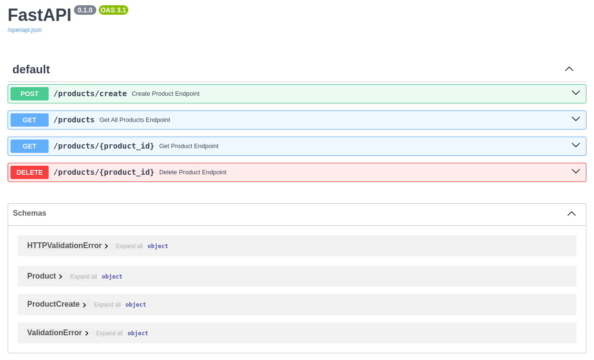
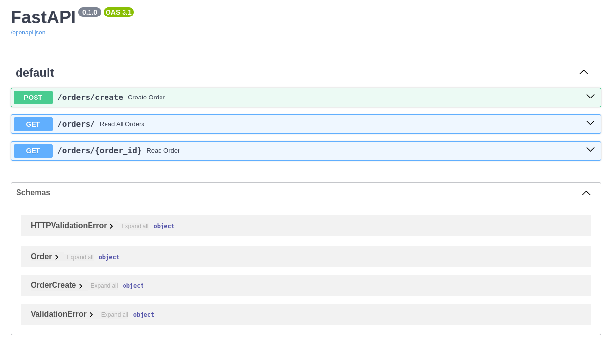
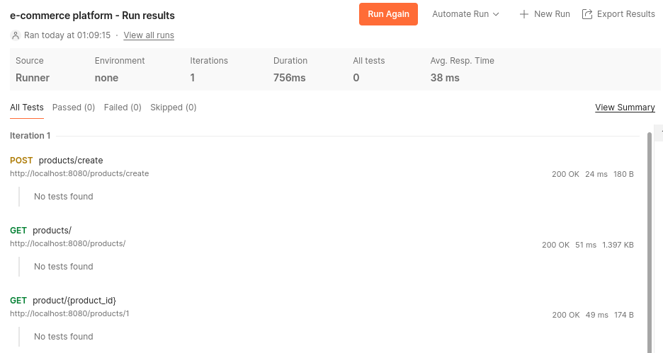

# E-Commerce platform using Microservices

A microservice application with two microservices, product and order. The application is built with FastAPI, SQLAlchemy and Docker.

Product is responsible for showing created products, creating a new product and basic CRUD functionality.
Order is responsible for creation and retrieval of orders. Made orders may also be displayed.

# Getting started

This app is in dockerized, for simplicity docker commands are inside a Makefile.

To start up the development server:
```bash
make up
```
To take the server down:
```bash
make down
```
To view logs:
```bash
make logs
```
The database may be deleted using:
```bash
make remove-db
```

# Architecture overview

## Communication

Communication between microservices is performed through HTTP requests. The order microservice, when creating an order communicated with the product microservice to retrive product details based on the ID.

The client needs to send a request to create an order to the order microservice. The order microservice validates the request and communicated to the product to retrieve details. Once the details are obtained the order is created.

## Design choices

- FastApi - picked for it's speed, simplicity and the OpenAPI documentation
- Docker - docker is used for contenerization and providing a consistent environment.
- SQLAlechemy and PostgreSQL - SQLAlchemy is used as the ORM tool, providing a Pythonic interface to interact with database. PostgreSQL is chosen for being an open-source relational database that's known for being reliable and extendable.
- Pydantic - Pydantic models offer a concise way to define structure of data in the application

# Testing

## FastApi

FastAPI has a built in docs feature that allows for testing the functions.

The product service can be seen and tested under:
<http://localhost:8080/docs#/>



The order service can be seen and tested under:
<http://localhost:8081/docs#/>



## Postman
Testing can also be done in Postman



Postman collection can be found under: e-commerce_platform.postman_collection.json

## Debugging DB

1. Enter `psql` with either `make psql-local` or `make psql-compose`
2. Use `psql` commands
